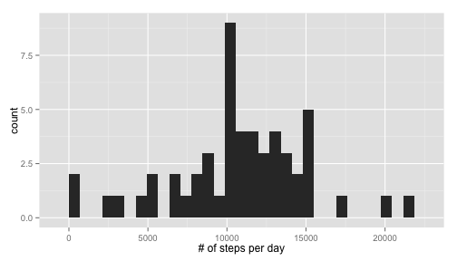
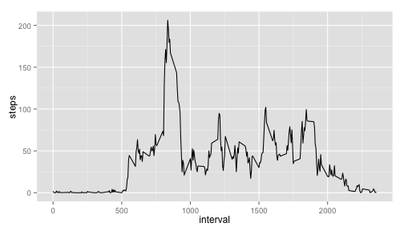
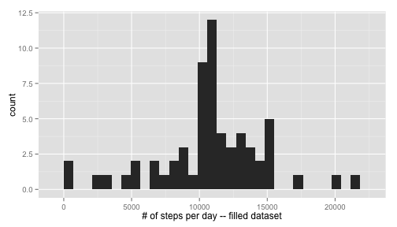
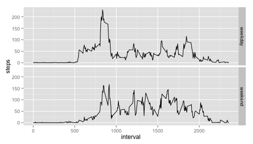

Reproducible Research: Peer Assessment 1
=========================

0. Introduction
---------------
Thoughout this exercise, we will be analyzing data from a personal activity monitoring device. This device collects data at 5 minute intervals during the day. The data consists of two months of data from an anonymous individual collected during the months of October and November, 2012 and include the number of steps taken in 5 minute intervals each day.

####Data
* steps: Number of steps taking in a 5-minute interval (missing values are coded as NA)
* date: The date on which the measurement was taken in YYYY-MM-DD format
* interval: Identifier for the 5-minute interval in which measurement was taken

So first, we read the data file. After this we will start answering questions related to it.


```r
activity <- read.csv("activity.csv")
activity$date <- as.Date(activity$date)
```

1. What is mean total number of steps taken per day?
----------------------------------------------------

```r
## Sumarize steps data by dates.  
dailyData <- aggregate(steps~date, data = activity, FUN = sum, na.rm = T)

## Calculate mean and median.
options(scipen=999)
meanSteps <- round(mean(dailyData$steps),2)
medianSteps <- quantile(dailyData$steps, probs = 0.5)
```

The mean steps were **10766.19** and the median **10765**.
Below you can find a histogram with the overall daily distribution.


```r
library(ggplot2)
qplot(steps, data=dailyData, geom="histogram") + labs(x="# of steps per day")
```

 

2. What is the average daily activity pattern?
----------------------------------------------

```r
## Sumarize steps data by intervals and find the one with most activity.
intervalData <- aggregate(steps~interval, data = activity, FUN = mean, na.rm = T)
intervalMax <- intervalData[which(intervalData$steps==max(intervalData$steps)),]
```

The interval with the highest means is **835**, registering an average of **206.1698** steps.

Below you can find the mean interval distribution.


```r
ggplot(intervalData, aes(x=interval, y=steps)) + geom_line()
```

 

3. Dealing with missing values.
-------------------------------

```r
# Count the number of NAs
totalNA <- sum(is.na(activity$steps))
```

The dataset contains a large number of missing values. To be precise, they represent **13.1148**% of the dataset. To fill in this missing data, we will use the average steps per interval we calculated eariler.


```r
# Create the new 'filled' dataset.
activityNew <- activity
# Loop through the dataset and look for missing values. If present, replace with the corresponding intervalData entry.
for(i in 1:nrow(activityNew)) {
  if(is.na(activityNew[i,1])) {
    activityNew[i,1] <- intervalData[intervalData$interval == activityNew[i,3], 2]
  }
}
```

Let´s analyze this new 'filled' dataset and see how it compares to the original one. For this, we will recreate the histogram, and recalculate the mean and median values.


```r
## Sumarize steps data by dates.  
dailyDataNew <- aggregate(steps~date, data = activityNew, FUN = sum, na.rm = T)

## Calculate mean and median.
options(scipen=999)
meanStepsNew <- round(mean(dailyDataNew$steps),2)
medianStepsNew <- quantile(dailyDataNew$steps, probs = 0.5)
```

The mean steps were **10766.19** and the median **10766.1887**.
Below you can find a histogram with the overall daily distribution.


```r
qplot(steps, data=dailyDataNew, geom="histogram") + labs(x="# of steps per day -- filled dataset")
```

 

As it can be seen, the mean steps per day are not altered by the filled data. This is because we are performing the 'filling' with values obtained from the original set. The median is slightly increased, and the historgram remains practically the same.

4. Weekend vs. Weekday patterns.
--------------------------------
Finally we investigate if there are differences between activity that takes place on weekends vs. weekdays.


```r
activityNew$weekday <- weekdays(activityNew$date)
w1 <- c("Sunday","Saturday")
for(i in 1:nrow(activityNew)) {
  if (activityNew[i,4] %in% w1) {
    activityNew[i,4] <- "weekend"
    } else {
      activityNew[i,4] <- "weekday"
      }
  }

intervalDataNew <- aggregate(steps~interval + weekday, data = activityNew, FUN = mean, na.rm = T)
ggplot(intervalDataNew, aes(x=interval, y=steps)) + geom_line() + facet_grid(weekday~.)
```

 
