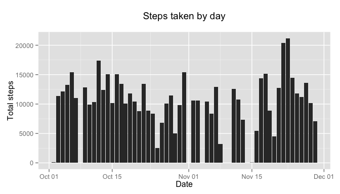
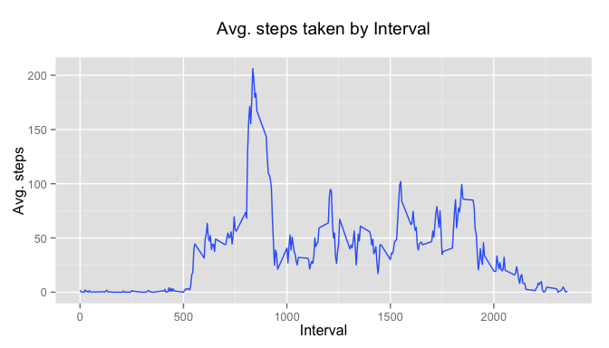

# Reproducible Research: Peer Assessment 1

We will be analyzing data from a personal activity monitoring device. This device collects data at 5 minute intervals through out the day. The data consists of two months of data from an anonymous individual collected during the months of October and November, 2012 and include the number of steps taken in 5 minute intervals each day.

####Data
* steps: Number of steps taking in a 5-minute interval (missing values are coded as NA)
* date: The date on which the measurement was taken in YYYY-MM-DD format
* interval: Identifier for the 5-minute interval in which measurement was taken

So first, we read the data file. After this we will start answering questions related to it.


```r
activity <- read.csv("activity.csv")
activity$date <- as.Date(activity$date, fomrat = "%m/%d%/%Y")
```

**What is mean total number of steps taken per day?**


```r
## Sumarize steps data by dates  
dateData <- aggregate(steps~date, data = activity, FUN = sum, na.rm = T)

## Now present mean and median
options(scipen=999)
meanSteps <- round(mean(dateData$steps),2)
medianSteps <- quantile(dateData$steps, probs = 0.5)
```

The mean steps were **10766.19** and the median **10765**.
Below you can find a histogram with the overall daily distribution.


```r
library(ggplot2)
dateHist <- qplot(x = date, y = steps, data = activity, stat= 'summary', fun.y=sum, geom='bar') +
        labs(title='Steps taken by day\n', y='Total steps', x='Date')
plot(dateHist)
```

```
## Warning: Removed 2304 rows containing missing values (stat_summary).
```

 

**What is the average daily activity pattern?**

```r
## Sumarize steps data by intervals and find the one with most activity.
intervalMean <- aggregate(steps~interval, data = activity, FUN = mean, na.rm = T)
intervalMax <- intervalMean[which(intervalMean$steps==max(intervalMean$steps)),]
```

The interval with the highest means is **835**.

Below you can find the mean interval distribution.


```r
# Calculate the mean on intervals
meanFun <- function(data){
    m <- mean(data)
    data.frame(y=m)
    }

# Use this to plot the time series.
qplot(x = interval, y = steps, data = activity, stat = 'summary', geom = 'smooth', fun.data = meanFun) +
     labs(title='Avg. steps taken by Interval\n', y='Avg. steps', x='Interval')
```

```
## Warning: Removed 2304 rows containing missing values (stat_summary).
```

 

**Imputing missing values**

Now we proceed to investigate missing values in the dataset.


```r
# Count the number of NAs
totalNAs <- sum(!complete.cases(activity))
stepNAs <- sum(is.na(activity$steps))

# Calculate the number of missing dates
totalDates <- seq.Date(from = min(activity$date),
                           to = max(activity$date),
                           by='1 day')
dateNAs <- sum(!activity$date[complete.cases(activity)] %in% totalDates)
```
